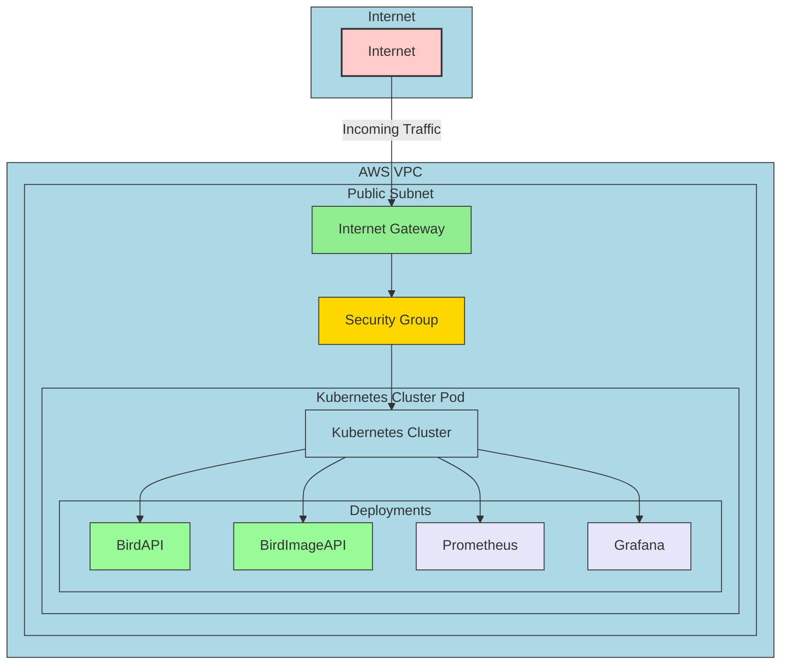
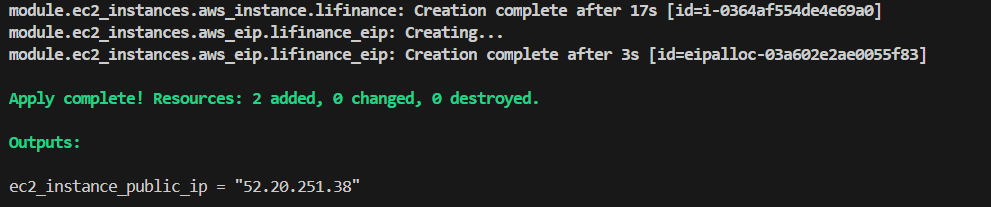
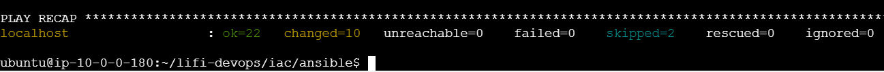
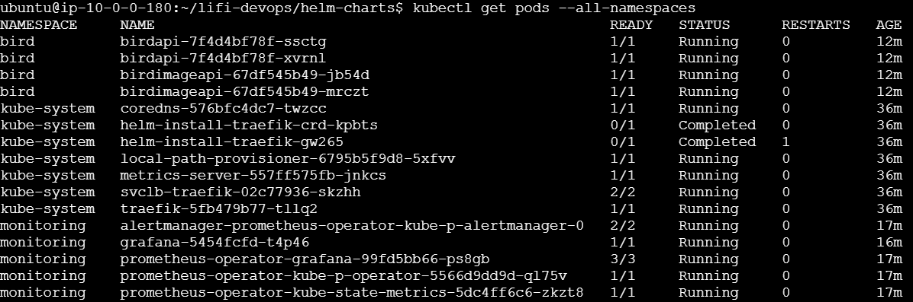
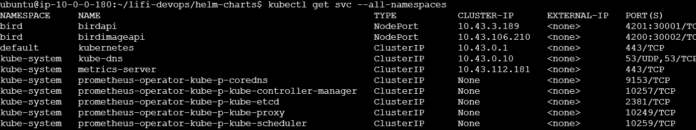
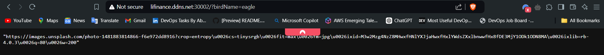
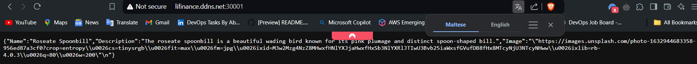
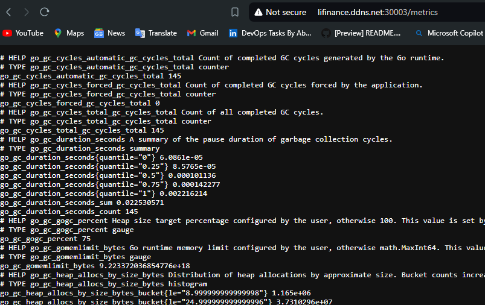
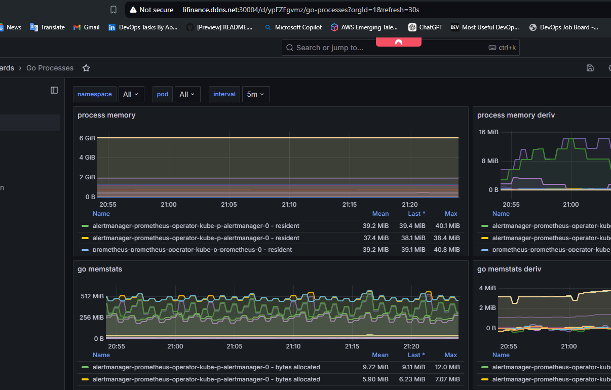
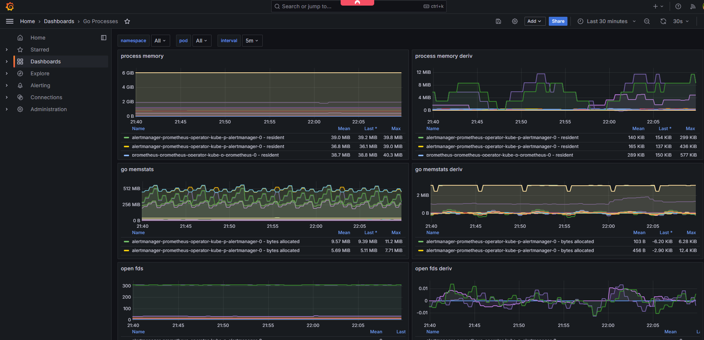

# Bird Application Deployment & Observability With Kubernetes & Helm

This project automates the deployment of 2 APIs, which work together to generate urls to birds (or even the image itself if an http element is added to the code). This is accomplished using IaC principles, containerization, configuration management with the inclusion of best practices and some security consciousness in mind, which will be seen in this documentation.

The **TLDR** is that Terraform provisions infrastructure on AWS, creating an EC2 instance and the required network components. Ansible configures the dependencies to that are required for this deployment (Docker, K3S, Helm). Kubernetes is used for container orchestration while Helm is used to perform seamless deployments of the apps.

**Architecture Diagram**
---

**Step 0 - Prerequisites**
---

The following are required before starting out this deployment.

- AWS account with IAM configured.

- AWS CLI installed on local PC

- Terraform

- SSH key used for logging into AWS.

**Step 1 - Understanding The APIs**
---

The 2 apis i the picture work together to produce urls of birds. The birdapi is dependent on the birdimageapi to run, else it will throw errors. A HTTP element can also be added to the source code to make the api show the image of the bird itself and not just the url, which is gotten from unsplash.com. (Note that you have to go into the source code to accomplish this).

**Step 2 - Upload TF State File To AWS**
---

*This step is where the building of the infrastructure would happen. It is recommended to have written a Dockefile for the apis and uploaded the containers to a repository at this point.*

* First, create a bucket on S3 to store your state file. This is recommended in real life scenarios and working with a team to prevent the nightmare of having corrupted state files. THis would also require creating a dynamodb table for integrity checks. Check the `bucket.tf` for info.

* After the bucket has been created, create a file called `backend.tf`, which will push your state file into the bucket and enfore integrity measures using dynamodb.

**Step 3 - Terraform Your Infrastructure**
---

This is where the entire infrastrure comes together using code. Here, Terraform deploys and configures the VPC, Internet Gateway, Routes,Security Group, Subnets, Instances and the other dependencies in between. 

*Modularization of code was done here to factor for future reuse and code refactoring. This is a best practice using Terraform*

*If you notice, the ingress for the security group on port 22 was limited to just one instance. This was done to limit the amount of devices who can ssh into the instance, which would reduce the attach surface. This is a security best practice. The code would be deployed onto the newly created terraform instance, but can only be run when going through the bastion server*

After a while, Terraform would finish provisioning the instances and you would see a successful message.

**Step 4 - Running Ansible Script**

- Next, login to the bastion server and ssh into the Kubernetes server. *Best practice here would be to set up `ssh-agent` on the bastion host to allow for seamless secure logins.*

- Ensure the repository where your codebase exists has been cloned onto the server. This would ensure that your code is pulled from the repository after it has been pushed.

- Navigate to the directory where your playbook or deployment file exists. This would be executed by ansible. Run the command `ansible-playbook -i localhost ansible_playbook.yaml` to kickstart the deployment. After a while, ansible would have provisioned the apis, grafana and prometheus.

**Step 5 - Perform Checks**
---

- After the successful message from ansible, you would need to confirm the apps and services are all up and running. On the cluster level, checking the pods, services, deployments and namespace would suffice as you would be able to tell if something went wrong. See example screenshot below:

*Another best practice here is to always ensure deployments have their own namespace, compared to deploying everything in the default. It is professional and is the first step in securing a kubernetes cluster.*

- Next would be to confirm if the apis are functioning properly and are able to communicate with each other. The apis can be reached over the internet using the EC2 IPaddress and the preconfigured NodePort. See example screenshot below:

*I mapped the elastic IP I provisioned for the service to a DNS name. It looks cleaner accessing the resources via a url instead of an IP*

**Step 6 - Observability Checks And Metrics**
---

- Log into the prometheus instance that was deployed. It can be accessed using the EC2 IP and the NodePort or a dns name. Include `/metrics` to the url to see if metrics are being scraped properly. See example screenshot below:

- Log into grafana to see the preconfigured dashboard with metrics gotten from prometheus. The credentials are `admin` and the password that was set in the deployment script. The default is `your-admin-password`. See example screenshot of grafana dashboard with realtime metrics and charts.

The above dashboard gives visuals on all running Go processes, as well as CPU, memory and others.

**Extra Best Practices**
---

The current deployment can also benefit from several industry best practices and security measures such as:
- More strict network policies for ingress and egress.
- Privilege management using IAM policies.
- Kubernetes secrets to prevent envs being hardcoded.
- Data encryption at rest and in transit.
- Node and pod security. Plus many others

**Deployment Successful!**